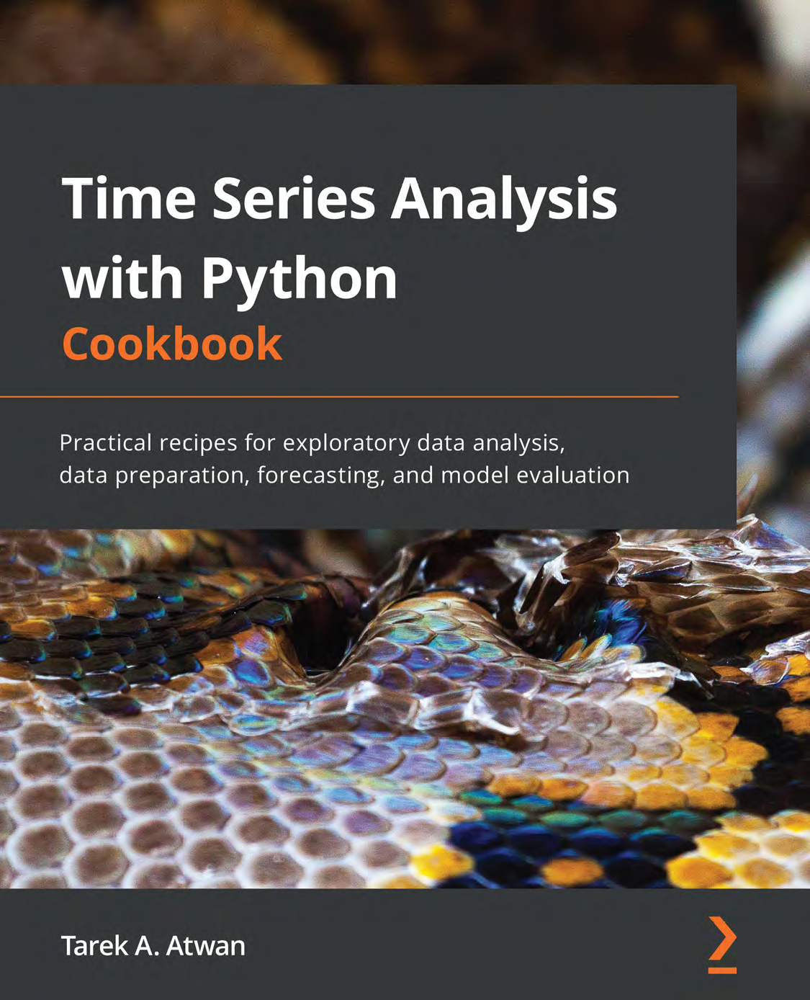

### [Packt Conference : Put Generative AI to work on Oct 11-13 (Virtual)](https://packt.link/JGIEY)

<b>

</b> 
3 Days, 20+ AI Experts, 25+ Workshops and Power Talks 

Code: <b>USD75OFF</b>

# Time Series Analysis with Python Cookbook

**Perform time series analysis and forecasting confidently with this Python code bank and reference manual**

### Get the book

* [Amazon](https://www.amazon.com/Time-Analysis-Python-Cookbook-exploratory-dp-1801075549/dp/1801075549/ref=mt_other?_encoding=UTF8&me=&qid=1655443714)
* [Packt](https://www.packtpub.com/product/time-series-analysis-with-python-cookbook/9781801075541)

### Key Features

- Explore forecasting and anomaly detection techniques using statistical, machine learning, and deep learning algorithms
- Learn different techniques for evaluating, diagnosing, and optimizing your models
- Work with a variety of complex data with trends, multiple seasonal patterns, and irregularities

### What you will learn

- Understand what makes time series data different from other data
- Apply various imputation and interpolation strategies for missing data
- Implement different models for univariate and multivariate time series
- Use different deep learning libraries such as TensorFlow, Keras, and PyTorch
- Plot interactive time series visualizations using hvPlot
- Explore state-space models and the Unobserved Components Model (UCM)
- Detect anomalies using statistical and machine learning methods
- Forecast complex time series with multiple seasonal patterns

### Book Description

Time series data is everywhere, available at a high frequency and volume. It is complex and can contain noise, irregularities, and multiple patterns, making it crucial to be well-versed with the techniques covered in this book for data preparation, analysis, and forecasting.

This book covers practical techniques for working with time series data, starting with ingesting time series data from various sources and formats, whether in private cloud storage, relational databases, non-relational databases, or specialized time series databases such as InfluxDB. Next, you'll learn strategies for handling missing data, dealing with time zones and custom business days, and detecting anomalies using intuitive statistical methods, followed by more advanced unsupervised ML models. The book will also explore forecasting using classical statistical models such as Holt-Winters, SARIMA, and VAR. The recipes will present practical techniques for handling non-stationary data, using power transforms, ACF and PACF plots, and decomposing time series data with multiple seasonal patterns. Later, you'll work with ML and DL models using TensorFlow and PyTorch.

Finally, you'll learn how to evaluate, compare, optimize models, and more using the recipes covered in the book.

### Who this book is for

This book is for data analysts, business analysts, data scientists, data engineers, or Python developers who want practical Python recipes for time series analysis and forecasting techniques. Fundamental knowledge of Python programming is required. Although having a basic math and statistics background will be beneficial, it is not necessary. Prior experience working with time series data to solve business problems will also help you to better utilize and apply the different recipes in this book.

### Table of Contents

1. Getting Started with Time Series Analysis

   > Chapter , *Getting Started with Time Series Analysis*, is a general introduction to Python development best practices. You will learn different techniques to create and manage virtual environments, install and manage Python packages, manage dependencies, and finally, how to install and manage Jupyter extensions.

2. Reading Time Series Data from Files

   > Chapter 2, *Reading Time Series Data from Files*,  is an introduction to time series data. This chapter shows you how to read data from various and commonly used file types, whether stored locally or on the cloud (such as AWS S3). The recipes will highlight advanced options for ingesting, preparing, and transforming data into a time series DataFrame for later analysis.

3. Reading Time Series Data from Databases

   > Chapter 3, *Reading Time Series Data from Database*s, picks up from Chapter 2, *ReadingTime Series Data from Files*, and focuses on reading data from various database systems, including relational (PostgreSQL and MySQL) and non-relational (MongoDB and InfluxDB), whether on-premises or a cloud service (Amazon Redshift and Snowflake). The recipes will highlight different methods and techniques to offer flexibility on how data can be ingested, prepared, and transformed into a time series DataFrame for later analysis.

4. Persisting Time Series Data to Files

   >  Chapter 4, *Persisting Time Series Data to Files*, covers different options and use cases to store time series data for later retrieval. The techniques will cover various methods and filetypes, whether on-premises or in the cloud. In addition, this chapter covers serialization, compression, overwriting, chunking, and appending to files.

6. Persisting Time Series Data to Databases

   >  Chapter 5, *Persisting Time Series Data to Databases*, builds on Chapter 4, *Persisting TimeSeries Data to Files*, focusing on writing data for scale. This covers different techniques for writing time series data to relational and non-relational database systems like those discussed in Chapter 2, *Reading Time Series Data from Files*, including on-premises and cloud services.

6. Working with Date and Time in Python

   > Chapter 6, *Working with Date and Time in Python*, takes a practical and intuitive approach to an intimidating topic. You will learn how to deal with the complexity of dates and time in your time series data. The chapter illustrates practical use cases for handling time zones, custom holidays, and business days, working with Unix epoch and UTC. Typically, this intimidating topic is presented in a fun and practical way that you will find helpful to apply right away.

7. Handling Missing Data

   > Chapter 7, *Handling Missing Data*, explores different methods for identifying and handling missing data. You will learn different **imputation** and **interpolation** techniques. The chapter starts with simple statistical methods for univariate imputation and then explores various univariate interpolation algorithms to more advanced multivariate imputation.

8. Outlier Detection Using Statistical Methods

   > Chapter 8, *Outlier Detection Using Statistical Methods*, covers statistical methods for outlier and anomaly detection. These practical yet straightforward techniques are easy to interpret and implement. The chapter uses data from the **Numenta Anomaly Benchmark (NAB)** to evaluate different anomaly detection algorithms.

9. Exploratory Data Analysis and Diagnosis

   > Chapter 9, *Exploratory Data Analysis and Diagnosis*, dives into visualization techniques for effective Exploratory Data Analysis (EDA) with interactive visualizations. You will learn how to investigate and diagnose your time series data to test for specific assumptions such as **stationarity** and **autocorrelation**. Finally, the chapter covers practical recipes for transforming your time series data using a family of **power transforms**, **decomposition**, and **differencing** methods.

10. Building Univariate Time Series Models Using Statistical Methods

    > Chapter 10, *Building Univariate Time Series Models Using Statistical Methods*, kick offs the journey into modeling and forecasting time series. The chapter intuitively explains what **autocorrelation function** (ACF) and **partial autocorrelation function** (PACF) plots are and how they are used, and then moves in to training, diagnosing, and comparing different models, including exponential smoothing, autoregressive integrated moving average (**ARIMA**), and seasonal ARIMA (**SARIMA**). Additionally, this chapter introduces grid search and **hyperparameter tuning**.

11. Additional Statistical Modeling Techniques for Time Series

    > Chapter 11, *Additional Statistical Modeling Techniques for Time Series*, picks up from Chapter 10, *Building Univariate Time Series Models Using Statistical Methods*, diving into more advanced and practical models, such as vector autoregressive (**VAR**) for multivariate time series, generalized autoregressive conditional heteroskedasticity (**GARCH**) for forecasting volatility, and explore the **Prophet** algorithm and library. You will also explore AutoArima and compare the results from the previous chapter.

12. Forecasting Using Supervised Machine Learning

    > Chapter 12, *Forecasting Using Supervised Machine Learning*, will take you from classical time series forecasting techniques to more advanced machine learning algorithms. The chapter shows how time series data can be transformed appropriately to be suitable for supervised machine learning. In addition, you will explore a variety of machine learning algorithms and implement **multi-step** forecasting, using both **Scikit-Learn** and **Sktime**.

13. Deep Learning for Time Series Forecasting

    >  Chapter 13, *Deep Learning for Time Series Forecasting*, covers more advanced deeplearning architectures using **TensorFlow**/Keras and PyTorch. The chapter starts with a high-level API (**Keras**) and then dives into more complex implementations, using a lower-level API (**PyTorch**). 

14. Outlier Detection Using Unsupervised Machine Learning

    >  Chapter 14, *Outlier Detection Using Unsupervised Machine Learning*, continues from Chapter 8, *Outlier Detection Using Statistical Methods*, but focuses on more advanced unsupervised machine learning methods. You will use the same datasets from the NAB to allow you to compare statistical and machine learning techniques using the same benchmark data. The techniques cover a variety of machine learning algorithms.

15. Advanced Techniques for Complex Time Series

    > Chapter 15, *Advanced Techniques for Complex Time Series*, will introduce more complex time series data that contains multiple seasonal patterns. The chapter includes how such time series data can be decomposed and explores different modeling techniques, including state-space models (for example, Unobserved Components Model). You will compare the results using **Unobserved Components Mode**l (UCM), with **Prophet** and **NeuralProphet**. 

### Python Libraries & Frameworks Covered

* [pandas](https://pandas.pydata.org)
* [Statsmodels](https://www.statsmodels.org/stable/index.html)
* [SciPy](https://scipy.org)
* [pmdarima](https://github.com/alkaline-ml/pmdarima) for AutoArima 
* [arch](https://github.com/bashtage/arch)
* [Scikit-Learn](https://scikit-learn.org/stable/)
* [sktime](https://www.sktime.org/en/stable/)
* [Darts](https://unit8co.github.io/darts/)
* [PyCaret](https://pycaret.org)
* [Prophet](https://facebook.github.io/prophet/)
* [NeuralProphet](https://neuralprophet.com/html/index.html)
* [PyOD](https://github.com/yzhao062/pyod)
* [TensorFlow](https://www.tensorflow.org)
* [PyTorch](https://pytorch.org)
* [Modin](https://modin.readthedocs.io/en/stable/) 
* [hvPlot](https://hvplot.holoviz.org)
* [Matplotlib](https://matplotlib.org)
* [seaborn](https://seaborn.pydata.org)
* [SQLAlchemy](https://www.sqlalchemy.org)

### Author Notes:

* Working on adding Colab notebook versions 
- [x] Chapter 11
- [x] Chapter 12
- [x] Chapter 14

* Added YAML environment file and requirements.txt files for each chapter
### Download a free PDF

 <i>If you have already purchased a print or Kindle version of this book, you can get a DRM-free PDF version at no cost. Simply click on the link to claim your free PDF.</i>

 <a href="https://packt.link/free-ebook/9781801075541">https://packt.link/free-ebook/9781801075541 </a> 

